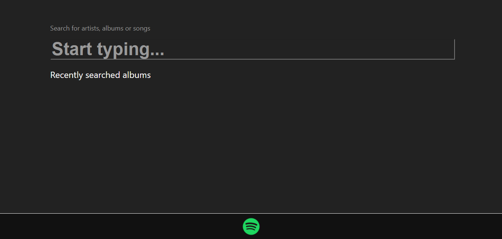
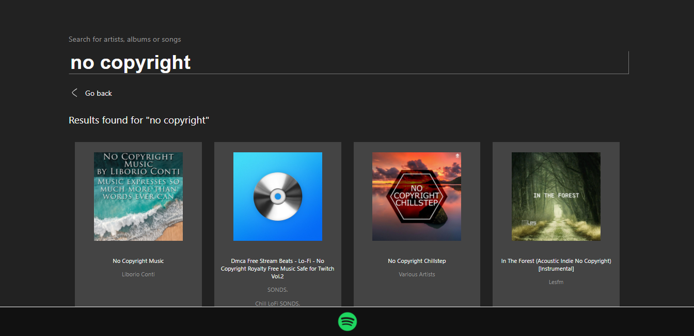
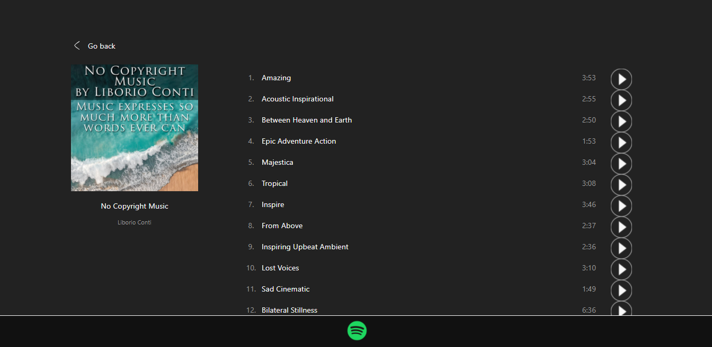
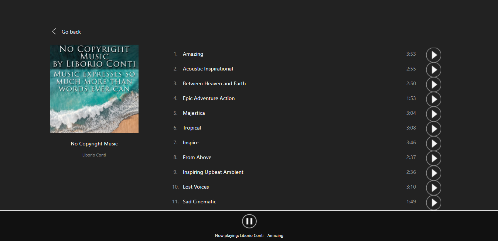
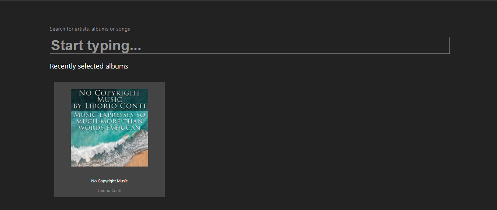
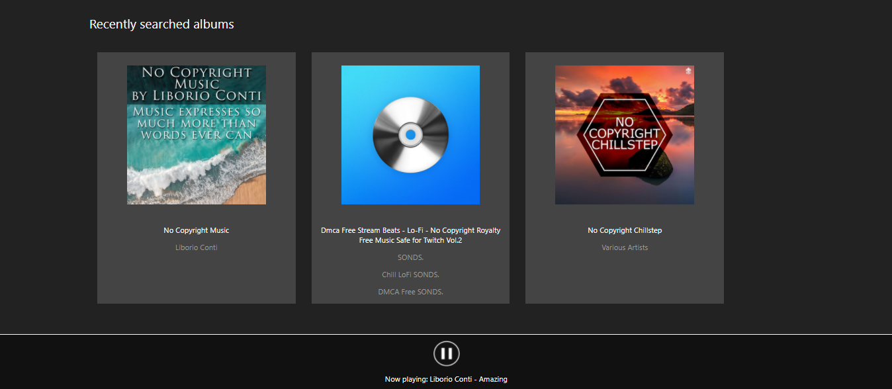

# Spotify Web Player Demo

This is a frontend project made with React, integrated with Spotify Web API that allows users to search for any Spotify albums based on a query string, view songs inside an album and play them if the user is authenticated into Spotify and has Spotify Premium.

## Features

The following features have been implemented in this project currently:
- Search for albums with query string
- View a specific album
- Login with Spotify
- Play Spotify songs (Premium only)
- View recently searched albums in the main page
- View recently clicked albums in the main page

## Structure & Libraries

Some libraries have been included to ensure the code is clean, well-structured and functioning, such as:
- `Axios`: Easy REST API communication with backend.
- `Redux`: Structured data with reducers and actions to avoid passing state properties deep into React components.
- `Uuid`: Used on React components inside list so each one has an unique ID, without the need of incremental IDs from iteration.

## Run and build

This project requires the backend project: https://github.com/andrewlod/spotify-clone-backend.git to be running along with it. Both of them are npm projects, therefore the build and run processes for both of them are similar. Please refer to the backend repository `README.md` file for any instructions on how to install it. 

Here is a list of commands used in order to run, build or test the project:

### `npm install` or `npm i`

Installs all dependencies required to run and build the project. This command must be run before any attempt to build or start the application.

### `npm start`

Runs the app in the development mode.\
Open [http://localhost:3000](http://localhost:3000) to view it in your browser.

### `npm test`

Unit tests are currently not implemented in this project.

### `npm run build`

Builds the app for production to the `build` folder.\
It correctly bundles React in production mode and optimizes the build for the best performance.

The build is minified and the filenames include the hashes.\

## Preview

Here are a few screenshots of how the project looks. 

### Main page

### Searching for albums

### Viewing album

### Logged into Spotify

### Playing song

### Recent albums

